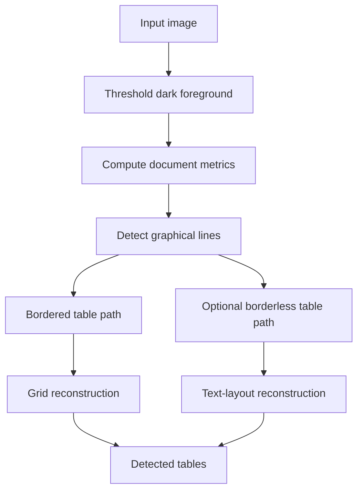
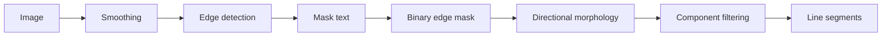
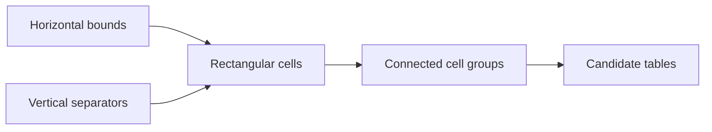
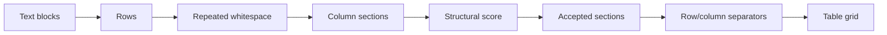

# Table Detection Algorithms

## TLDR

Table detection starts by building scale-aware document metrics from the foreground content. Those
metrics guide two complementary detection paths:

- bordered tables are reconstructed from visible horizontal and vertical ruling lines;
- borderless tables are reconstructed from repeated text alignment and persistent whitespace.

Both paths produce candidate row-column grids, then validate them against foreground content and
structural consistency. The result is a detector that can handle fully ruled tables, partially ruled
tables, and tables expressed only through text layout.

## Table of Contents

- [Pipeline Overview](#pipeline-overview)
- [Foreground Thresholding](#foreground-thresholding)
- [Document Metrics](#document-metrics)
- [Graphical Line Detection](#graphical-line-detection)
- [Bordered Table Detection](#bordered-table-detection)
- [Borderless Table Detection](#borderless-table-detection)

## Pipeline Overview

## Foreground Thresholding

The process starts by converting the image into a binary foreground mask. Dark visual elements such
as text, borders, and ruling lines become foreground pixels, while the page background is suppressed.

The thresholding adapts to local page conditions so documents with uneven lighting, scans, or
background variation can still produce a usable foreground mask. This mask is reused by later
stages to estimate text geometry and to isolate candidate table structures.

## Document Metrics

Before detecting tables, the algorithm estimates scale-dependent document metrics. The most
important metrics are:

- typical character size;
- typical distance between text rows;
- approximate text contour geometry.

These values let the detector scale its thresholds to the current document. For example, a line
that is meaningful in a low-resolution scan may be too short to matter in a high-resolution scan.
Using document metrics reduces the need for fixed pixel constants.

At this stage, connected components are filtered to remove small noise, dots, and line-like
artifacts when estimating text size. Nearby characters are grouped into larger text contours so row
spacing can be estimated from text blocks rather than from individual pixels.

## Graphical Line Detection

Line detection is a computer vision pass that looks for horizontal and vertical ruling lines.

The image is first smoothed to reduce local noise while preserving strong edges. An edge detector is
then applied to highlight abrupt intensity changes. Text contours identified during metric
computation are masked out so letters are less likely to be confused with table borders.

The resulting edge image is binarized into a candidate line mask. Directional morphological filters
are then applied:

- horizontal kernels keep long horizontal structures and suppress vertical or compact shapes;
- vertical kernels keep long vertical structures and suppress horizontal or compact shapes;
- closing operations reconnect small gaps in broken, hollow, or dotted lines;
- a final length filter removes components that are too short for the document scale.

## Bordered Table Detection

Bordered table detection is based on visible ruling lines. It assumes that table structure is
mostly defined by horizontal and vertical borders.

### Candidate Grid Construction

The algorithm searches for compatible pairs of horizontal lines that can form the top and bottom of
a table row. Within each row band, vertical lines that span the band are used as column separators.
Adjacent separators define rectangular candidate cells.

This creates a geometric grid from the detected line network:

Duplicate and near-duplicate cells are removed, and slightly misaligned separators are normalized so
the candidate grid behaves as a coherent table rather than as many independent line fragments.

### Table Reconstruction

Cells that touch or align with each other are clustered into candidate tables. Each cluster is
converted into a row-and-column grid by collecting its horizontal and vertical delimiters.

When one visual cell spans several grid positions, the same cell region is reused across those
positions. This preserves merged-cell structure without requiring every internal border to be
visible.

The reconstructed grid is then compared with the foreground content. Rows or columns with no
meaningful content are removed when they appear to be artifacts of the line geometry rather than
real table structure.

### Semi-Bordered and Implicit Structure

Some tables are only partially ruled. The detector can infer missing cells from the surrounding
line structure when enough evidence exists. It can also infer additional row or column separators
from the content layout inside an already detected table:

- row separators can be inferred from repeated text baselines;
- column separators can be inferred from persistent vertical whitespace.

This allows the bordered path to handle tables that combine explicit borders with whitespace-based
structure.

## Borderless Table Detection

Borderless table detection is based on text alignment and whitespace. It is used for tables whose
structure is visible through repeated rows and columns rather than drawn borders.

### Text Layout Mask

The detector first builds a cleaner text mask. Graphical lines are removed, noise is filtered, and
punctuation is handled separately so it does not distort text-line grouping.

The cleaned text is processed with adaptive run-length smoothing, following the ARLSA approach from
Nikolaou et al., "A segmentation framework for historical machine-printed documents", Image and
Vision Computing 28 (2010) 590-604. This connects nearby characters that likely belong to the same
text line while avoiding large whitespace obstacles. The result is a mask of text lines and text
blocks suitable for layout analysis.

### Layout Region Detection

The algorithm searches for vertical whitespace bands that persist across multiple text rows. These
bands are potential separators between columns. Long whitespace bands are interrupted when crossing
horizontal graphical lines or unrelated layout breaks, preventing one separator from spanning
multiple independent page regions.

If the page contains multi-column document layout, this stage splits the page into independent
regions before looking for tables. This prevents two prose columns from being interpreted as one
wide table.

### Column Section Detection

Within each layout region, text blocks are grouped into rows. The detector then searches for
repeated vertical whitespace patterns across those rows. A candidate section is formed when several
nearby rows appear to share a common column layout.

Compatible neighboring sections are merged, while inconsistent sections are split or rejected. The
goal is to keep regions where alignment repeats enough to suggest tabular structure.

### Structural Validation

Each candidate section is scored using functional table signals:

- enough rows and columns to form a real table;
- repeated column presence across rows;
- consistent spacing between rows and columns;
- strong alignment of text blocks within columns;
- connected structure across the row-column layout;
- low likelihood of being ordinary prose or page columns.

Candidates that are too small, too sparse, poorly aligned, or prose-like are rejected. Remaining
sections are treated as borderless table candidates.

### Table Reconstruction

Accepted sections are converted into tables by deriving column separators from whitespace and row
separators from text-line ranges. Neighboring sections can be bridged when their column layouts are
compatible and the vertical gap between them is small.

This handles common borderless-table patterns such as headers, subtotal rows, or rows with one
missing or merged column.

